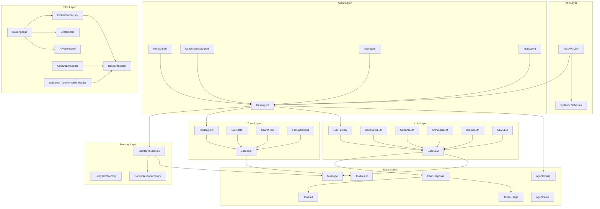
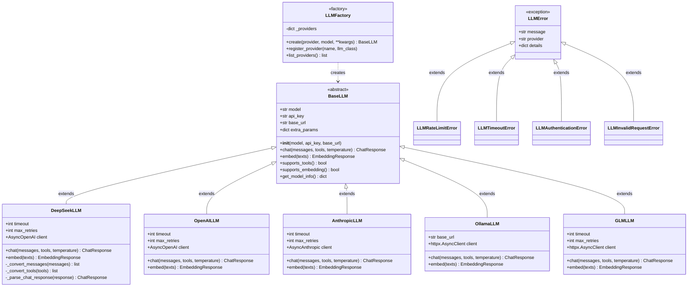
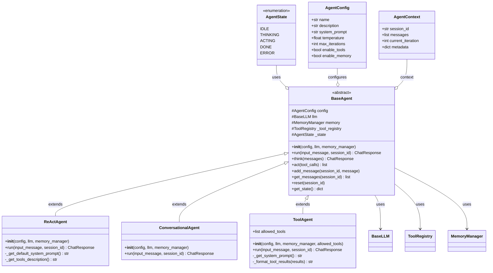
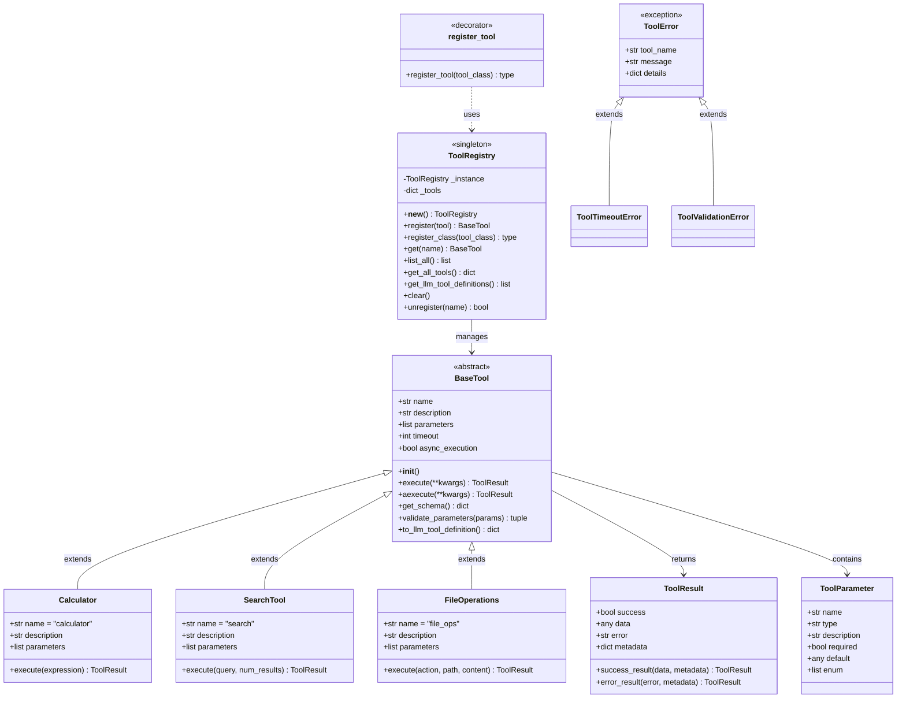
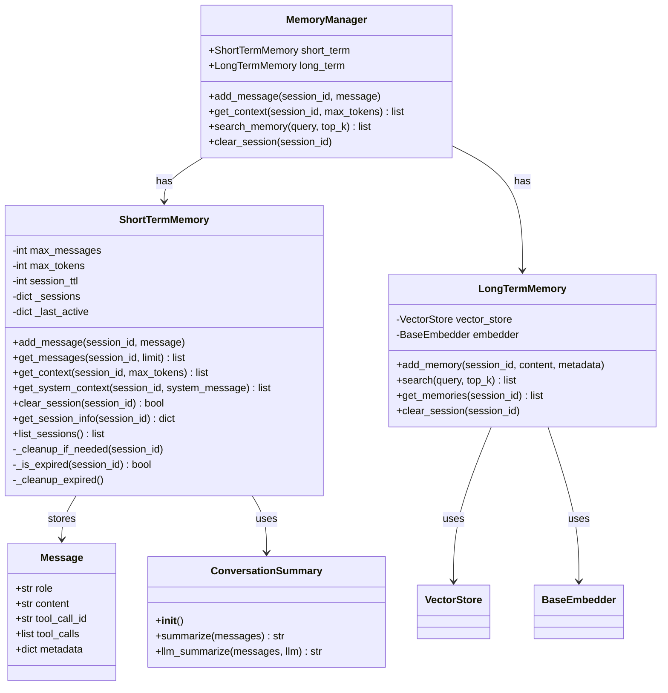
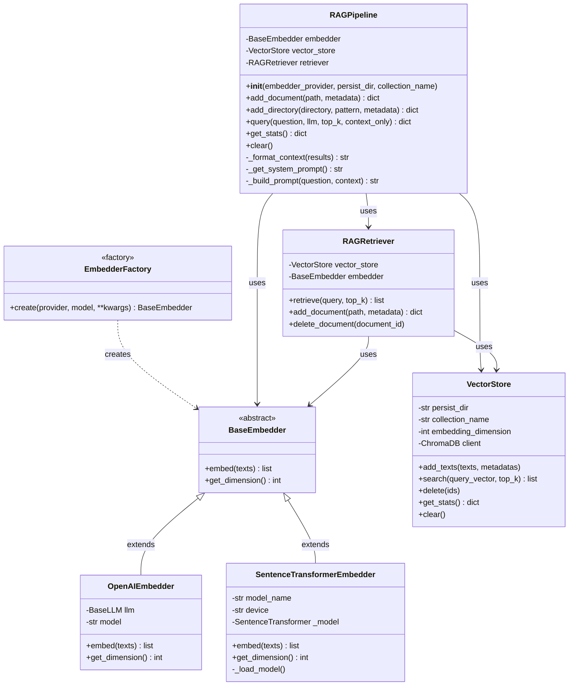
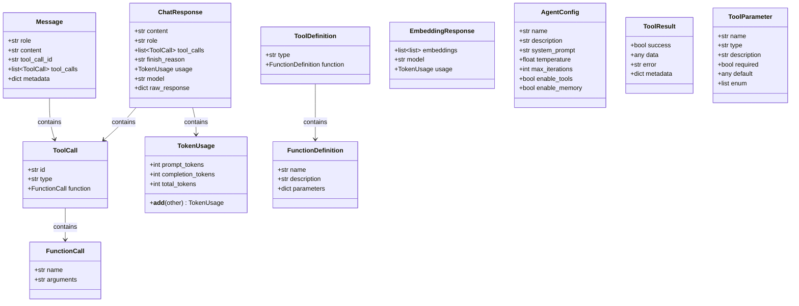
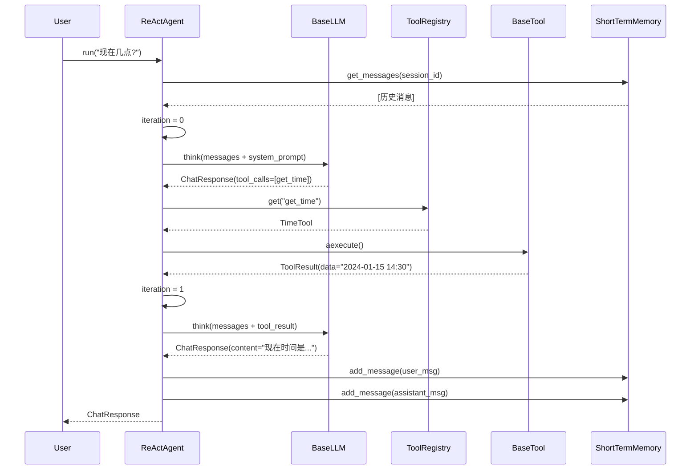
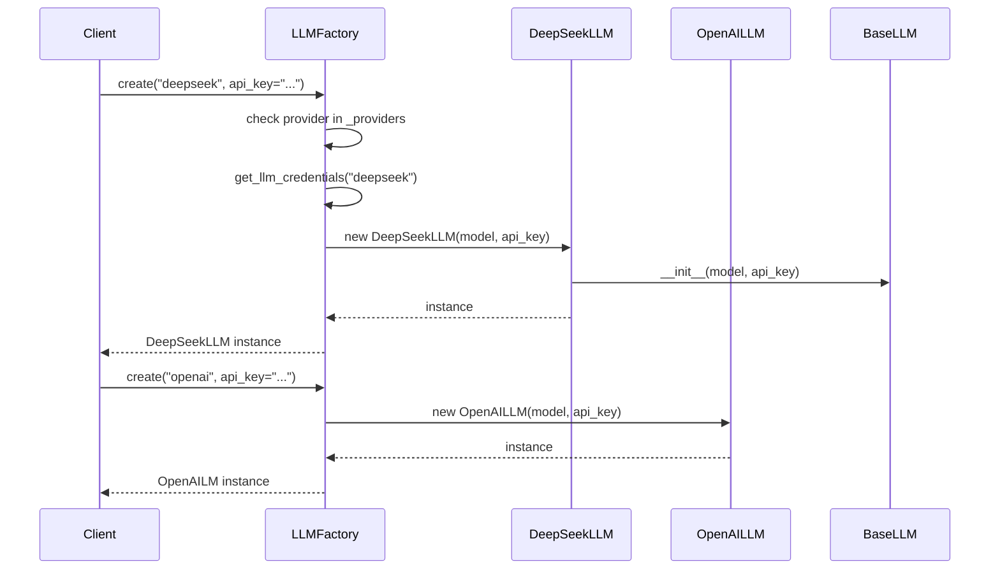
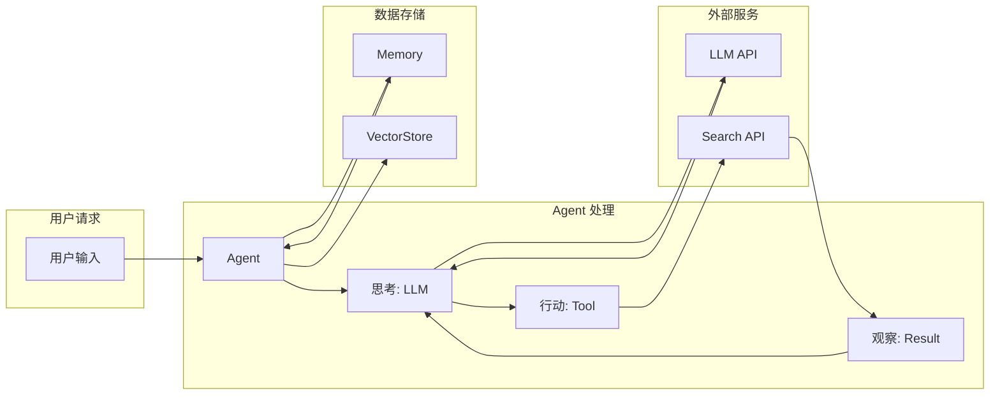

# Agent Learning Project - UML Class Diagram

> 完整的项目类图架构

## 1. 整体架构图



---

## 2. LLM 模块详细类图



---

## 3. Agent 模块详细类图



---

## 4. Tools 模块详细类图



---

## 5. Memory 模块详细类图



---

## 6. RAG 模块详细类图



---

## 7. 数据模型详细类图



---

## 8. 设计模式标记

```mermaid
graph TB
    subgraph "工厂模式 Factory Pattern"
        F1[LLMFactory]
        F2[EmbedderFactory]
    end

    subgraph "单例模式 Singleton Pattern"
        S1[ToolRegistry]
    end

    subgraph "装饰器模式 Decorator Pattern"
        D1[@register_tool]
    end

    subgraph "模板方法模式 Template Method Pattern"
        T1[BaseLLM]
        T2[BaseAgent]
        T3[BaseTool]
        T4[BaseEmbedder]
    end

    subgraph "策略模式 Strategy Pattern"
        ST1[DeepSeekLLM]
        ST2[OpenAILLM]
        ST3[AnthropicLLM]
    end

    subgraph "状态模式 State Pattern"
        ST[AgentState]
    end

    subgraph "管道模式 Pipeline Pattern"
        P1[RAGPipeline]
    end

    subgraph "观察者模式 Observer Pattern"
        O1[ConversationSummary]
    end
```

---

## 9. 时序图：ReAct Agent 执行流程



---

## 10. 时序图：LLM 工厂创建



---

## 11. 组件交互图



---

> 本类图涵盖了项目的核心架构：
> - **LLM 抽象层**：多提供商支持
> - **Agent 系统**：ReAct 循环实现
> - **工具系统**：装饰器注册模式
> - **记忆系统**：短期 + 长期记忆
> - **RAG 系统**：检索增强生成
